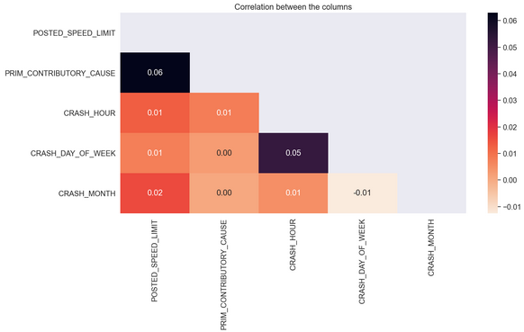

PREDICTING THE NUMBER OF TRAFFIC ACCIDENT INJURIES IN CHICAGO¶

Project Overview

Chicago is a busy city packed with traffic. All of this traffic dramatically raises the risk of a major car accident on any given roadway. On November 19, 2019, an unlicensed and uninsured driver failed to slow down at the intersection of 69th Street and Stony Island Avenue in Chicago, hitting and killing a bicyclist. On January 23, 2020, four people were killed in a crash involving a school bus, taxi, and a pickup truck at the intersection of Stony Island Avenue, 79th Street and South Chicago Avenue. The pickup driver ran a red light, first hit the taxi driver and then the bus driver, who was at the intersection. From 2019 to 2020, Chicago’s traffic fatalities increased by 16 percent – making 2020 the deadliest year for Illinois drivers in 13 years. The high volume of traffic accidents, injuries, and deaths might lead one to question: what are the main causes of car accidents in Chicago?

Business Understanding.

The goal of this project is to produce a predictive model that would facilitate the analysis of the primary causes for car crashes in Chicago City. Using data provided by the City of Chicago, the aim is to use the information provided from the Chicago Data Portal and identify patterns and trends that can be implemented with satisfactory results. The goal is to reduce the instances of crashes with preventive measures informed by the predictive model.

Research Question

To  produce a predictive model that would facilitate the analysis of the primary causes for car crashes in Chicago City to help  reduce the instances of crashes with preventive measures informed by the predictive model.

Objectives

Main Objective
To produce a predictive model that would facilitate the analysis of the primary causes for car crashes in Chicago City.

Sub Objectives

Analyze control failures to identify opportunities for improvement
Check for trends in the time of crash to relocate resources appropriately
Check for accidents caused by poor road quality and conditions and how to improve on it.
Check for accidents caused by natural forces.

Data Understanding.

The Traffic Crashes data comes from the Chicago Data Portal, an open data source maintained by the city of Chicago. The dataset contains all traffic crashes that were reported by the police within the city limits, going back to 2017. Linked to the crash dataset are two datasets corresponding to Vehicles and Persons involved in the crash. Each crash incident has a unique crash record ID and report number associated with it, which allows for cross-referencing on the dashboards provided for the datasets. A link to the main dataset can be found here: https://data.cityofchicago.org/Transportation/Traffic-Crashes-Crashes/85ca-t3if

## Data Exploration

### crashes count vs device condition

From the graph above, we can tell that crashes were high when the traffic control devices were not at site or in place. This could include no pavement markers, signs, signals, barricades and temporary signage that serve to inform and guide motor vehicles, pedestrians and cyclists regarding the rules of the road. 

### crash count per hour

From the graph above, The afternoon rush hour tends to be more dangerous for drivers than the morning rush. The reason? There’s a variety of factors that contribute to these noon-time crashes, including:

* Distractions like phone calls and texts
* Aggressive driving and speeding as people hurry to get home
* Teenage drivers leaving school
* The prevalence of school buses and delivery vehicles
* Drowsy driving
* We tend to be stressed and preoccupied with the late afternoon after a long day at work, and this contributes to the higher accident rates during the afternoon rush hour.

### crash count per day of week

From the graph above, Overall, weekends have a larger volume of cars traveling. The number of cars is highest on Saturday, followed by Sunday, and then Friday. The more congestion there is, the higher your chances are of getting into an accident.

### crash count per month

From the above graph, most crashes happen within the second term of the year which is during the autumn season. Its where the weather can be highly unpredictable. Warm weather, rain, fog, frost, and sometimes snow can seemingly pop up in the forecast overnight. Heavy rainfall and frost can make the roads slippery, and fog can reduce visibility, increasing the risk of car accidents.

### crash count per damage estimation

From the graph avove, most reported crashes have an estimated damage of over 1500 dollars. This could be due to the fault and liability for the crash and statements about the car accidents.

### crash count per lighting condition

From the graph above, car crashes are more during the day. This could be due to the afternoon rush hour as explained in the crash_hour graph.

### crash count per airbag deployed

From the above graph, we notice that most cars that were involved in a crash had their airbag deployed. Meaning the harder the impact, then the airbag deploys. This shows that the crash must have been very serious.

### crash count per sex

From the graph above, Men apparently have the highest number of car crashes. Though this is not a shock as we know men love cars. Men engage in riskier behavior while driving: Men are less likely to wear seatbelts, and they are more likely to drive while intoxicated or drowsy. Such impairment can lead to accidents, and without seatbelts, men have a greater likelihood of dying. Men Drive More Than Women: Men log more miles on the road than women do, which gives them more experience behind the wheel. But it also means they account for more accidents because they are more likely to be driving than a woman. Men Speed More Than Women: The faster you drive your car, the higher the possibility you will get in an accident. This is especially true with younger men because they are almost twice as likely to die in a crash caused by high speeds than women.

### crash count per travel direction

From the graph above, we can tell that the areas within North, East, West and South have a high number of car crashes. With this information, one should be careful around those areas to avoid the risk of getting an accident. Reason been its happening could be because of maybe weather factors, busy streets...etc

### crash count per driver vision

From the graph above, significantly more crash incidences is where driver vision was NOT obscured. Yet again, we see a high incidence of UNKNOWN values.

### crash count per driver action

From the above graph, winning by a significant majority, the primary offense committed by drivers in our dataset is NONE and yet still UNKNOWN.

### crash count per vehicle defect

From the above graph, If vehicles had a defect, most had issues with the NONE and UNKNOWN as well.

## Correlation

From the above correlation, we can tell that the ones ranging in the highest are between PRIM_CONTRIBUTORY_CAUSE and POSTED_SPEED_LIMIT 0f 0.05, and CRASH_DAY_OF_WEEK and CRASH_HOUR. The lowest is between CRSH_DAY_OF_WEEK and CRASH_MONTH.

# modelling

1.) Logistic Regression Model

* The baseline_log_loss is **0.5833135603648449**.
* The accuracy is **0.6613448648648649**.
* The recall is **0.2526898247771288**.
* The precision is **0.49695198750566777**.
* The AUC is **0.7097859344407482**

In this model our accuracy was **66%** and AUC is **70%**

2.) K Nearest Neighbour Model

* The baseline_log_loss is **1.7893844751451298**.
* The accuracy is **0.7402032432432433**.
* The recall is **0.5526180961164053**.
* The precision is **0.6317392450288458**.
* The AUC is **0.6521851756929807**

In this model our accuracy was **74%** and AUC is **65%**

3). Decision Tree Model

* The baseline_log_loss is **6.625605348564119**.
* The accuracy is **0.8410118918918918**.
* The recall is **0.7712880418075623**.
* The precision is **0.7610140788110102**.
* The AUC is **0.6973719404360946**

In this model our accuracy was **84%%** and AUC is **70%**

As for the final model, DecisionTreeClassifier was the best fit model. This is because:-
* Accuracy score is 84% which is the highest as compared to KNN and Logistic Regression.
* Precision score is 76% which is the highest as compared to KNN and Logistic Regression.
* Recall score is 77% which is the highest as compared to KNN and Logistic Regression.

Can conclude that the higher the percentage, the better the model is performing as one can verify from the accuracy, precision and recall score. 

# conclusion

1. Road traffic injury is a threat to the health and development.
2. No institutional frameworks exist within the region.
3. Legislation and enforcement of key road safety interventions need to be strengthened in many regions.
4. Adherence to vehicle and road design safety standards is low in the region.
5. Some important data are non-existent or incomplete.

# Recommendations

1. Establish and strengthen lead agencies and manage performance through targetsetting. 
2. Make safe, healthy, environment-friendly transport choices; design transport around walking, cycling and public transport. 
3. Focus on implementing the five most effective interventions to reduce chances of injury during a crash.
   * Control speed. Speed limits on urban and rural roads and motorways should be set by defining each road type in the          regions. 
   * Implement seatbelt laws. Seatbelt laws should apply to all vehicle occupants; and these laws should be better              enforced.
   * Enforce use of standard motorcycle helmets. Motorcycle helmet law should include pillion riders and a standard needs        to be defined for these helmets in the regions. 
   * Ascertain the role of alcohol in road crashes and control it, if found to be a problem. 
4. Allow only safe vehicles on the roads. Vehicle manufacturing and import standards should be evaluated in the region to ensure that only vehicles that allow international safety standards.
5. Ensure safe road design through safety audits at all stages of road construction and maintenance. 
6. Improve trauma care. A pre-hospital care system of ambulances connected through a universal access number is an important but just one component of a comprehensive trauma system. 
7. Define data needs; harmonize definitions and data collection methodology in order to advocate the need for road safety targets.
8. Enhance institutional capacity for data gathering, analysis and dissemination.
9. Implemention of collaborative relationships between health, police and traffic authorities will need to be established for setting up surveillance systems. 

